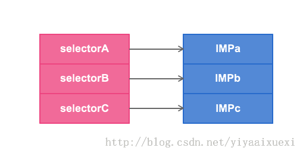
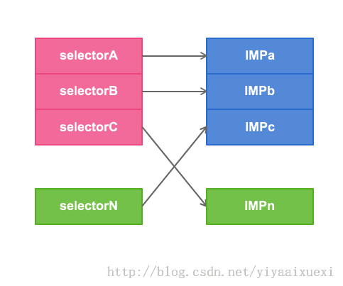

方法交换 Method Swizzling
=================
在Objective-C中调用一个方法，其实是向一个对象发送消息，查找消息的唯一依据是selector的名字。利用Objective-C的动态特性，可以实现在运行时偷换selector对应的方法实现，达到给方法挂钩的目的。

每个类都有一个方法列表，存放着selector的名字和方法实现的映射关系。IMP有点类似函数指针，指向具体的Method实现。



我们可以利用 method_exchangeImplementations 来交换2个方法中的IMP，  
我们可以利用 class_replaceMethod 来修改类，  
我们可以利用 method_setImplementation 来直接设置某个方法的IMP，  
……

归根结底，都是偷换了selector的IMP，如下图所示：
  

举个例子好了，我想钩一下NSArray的lastObject 方法，只需两个步骤:  

**参见代码：Demo_1**  
第一步：给NSArray加一个我自己的lastObject:  

```
#import "NSArray+Swizzle.h"
@implementation NSArray (Swizzle)
- (id)myLastObject {
    id ret = [self myLastObject]; // 乍一看，这不递归了么？别忘记这是我们准备调换IMP的selector，[self myLastObject] 将会执行真的 [self lastObject]
    NSLog(@"%s", __func__);
    return ret;
}
@end
```

第二步：调换IMP  

```
#import <Foundation/Foundation.h>
#import <objc/runtime.h>
#import "NSArray+Swizzle.h"
int main(int argc, const char * argv[]) {
    @autoreleasepool {
        Method originMethod = class_getInstanceMethod([NSArray class], @selector(lastObject));
        Method myMethod = class_getInstanceMethod([NSArray class], @selector(myLastObject));
        method_exchangeImplementations(originMethod, myMethod);
        NSArray *array = @[@"0", @"1", @"2", @"3"];
        NSString *string = [array lastObject];
        NSLog(@"%@", string);
        /**
         * 程序执行结果：
         -[NSArray(Swizzle) myLastObject]
         3
         */
    }
    return 0;
}
```


参考链接：  
<http://blog.csdn.net/yiyaaixuexi/article/details/9374411>