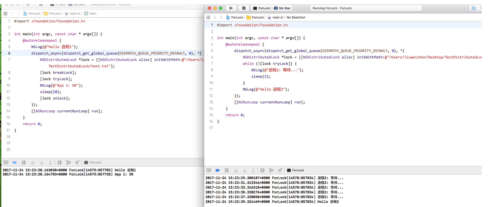

# 多线程相关知识汇总

参考链接:

[雷纯锋博文](http://blog.leichunfeng.com/blog/2015/07/29/ios-concurrency-programming-operation-queues/)

[CocoaChina博文]([http://www.cocoachina.com/ios/20150807/12911.html](http://www.cocoachina.com/ios/20150807/12911.html))

[Apple Doc](https://developer.apple.com/library/content/documentation/Cocoa/Conceptual/Multithreading/Introduction/Introduction.html)

[tanhao](http://www.tanhao.me/pieces/616.html/)

[tanhao_2]([http://www.tanhao.me/pieces/643.html/](http://www.tanhao.me/pieces/643.html/))

[简书的一篇文章](http://www.jianshu.com/p/ed312c734369)


### 基础概念

- 串行 vs. 并发

  从本质上来说，串行和并发的主要区别在于允许同时执行的任务数量。串行，指的是一次只能执行一个任务，必须等一个任务执行完成后才能执行下一个任务；并发，则指的是允许多个任务同时执行.

- 同步 vs. 异步

  同样的，同步和异步操作的主要区别在于是否等待操作执行完成，亦即是否阻塞当前线程。同步操作会等待操作执行完成后再继续执行接下来的代码，而异步操作则恰好相反，它会在调用后立即返回，不会等待操作的执行结果。

- 队列 vs. 线程


  串行队列一次只能执行一个任务，而并发队列则可以允许多个任务同时执行。iOS 系统就是使用这些队列来进行任务调度的，它会根据调度任务的需要和系统当前的负载情况动态地创建和销毁线程，而不需要我们手动地管理

- Operation Queues vs. Grand Central Dispatch (GCD)

  GCD 是苹果基于 C 语言开发的，一个用于多核编程的解决方案，主要用于优化应用程序以支持多核处理器以及其他对称多处理系统。而 Operation Queues 则是一个建立在 GCD 的基础之上的，面向对象的解决方案, 各自的使用场景：

  1. Operation Queues ：相对 GCD 来说，使用 Operation Queues 会增加一点点额外的开销，但是我们却换来了非常强大的灵活性和功能，我们可以给 operation 之间添加依赖关系、取消一个正在执行的 operation 、暂停和恢复 operation queue 等；
  2. GCD ：则是一种更轻量级的，以 FIFO 的顺序执行并发任务的方式，使用 GCD 时我们并不关心任务的调度情况，而让系统帮我们自动处理。但是 GCD 的短板也是非常明显的，比如我们想要给任务之间添加依赖关系、取消或者暂停一个正在执行的任务时就会变得非常棘手

### 关于 Operation 对象

在 iOS 开发中，我们可以使用 NSOperation 类来封装需要执行的任务，而一个 operation 对象（以下正文简称 operation ）指的就是 NSOperation 类的一个具体实例。NSOperation 本身是一个抽象类，不能直接实例化，因此，如果我们想要使用它来执行具体任务的话，就必须创建自己的子类或者使用系统预定义的两个子类:

- NSInvocationOperation
- NSBlockOperation

自定义子类继承于NSOperation, 并实现内部相应的方法

**NSInvocationOperation** ：我们可以通过一个 object 和 selector 非常方便地创建一个 NSInvocationOperation ，这是一种非常动态和灵活的方式。假设我们已经有了一个现成的方法，这个方法中的代码正好就是我们需要执行的任务，那么我们就可以在不修改任何现有代码的情况下，通过方法所在的对象和这个现有方法直接创建一个 NSInvocationOperation.

**NSBlockOperation** ：我们可以使用 NSBlockOperation 来并发执行一个或多个 block ，只有当一个 NSBlockOperation 所关联的所有 block 都执行完毕时，这个 NSBlockOperation 才算执行完成，有点类似于 dispatch_group 的概念.

另外，所有的 operation 都支持以下特性：

1. 支持在 operation 之间建立依赖关系，只有当一个 operation 所依赖的所有 operation 都执行完成时，这个 operation 才能开始执行；
2. 支持一个可选的 completion block ，这个 block 将会在 operation 的主任务执行完成时被调用
3. 支持通过 KVO 来观察 operation 执行状态的变化；
4. 支持设置执行的优先级，从而影响 operation 之间的相对执行顺序
5. 支持取消操作，可以允许我们停止正在执行的 operation

**并发 vs. 非并发 Operation**

通常来说，我们都是通过将 operation 添加到一个 operation queue 的方式来执行 operation 的，然而这并不是必须的。我们也可以直接通过调用 start 方法来执行一个 operation ，但是这种方式并不能保证 operation 是异步执行的。NSOperation 类的 isConcurrent 方法的返回值标识了一个 operation 相对于调用它的 start 方法的线程来说是否是异步执行的。在默认情况下，isConcurrent 方法的返回值是 NO ，也就是说会阻塞调用它的 start 方法的线程。

如果我们想要自定义一个并发执行的 operation ，那么我们就必须要编写一些额外的代码来让这个 operation 异步执行。比如，为这个 operation 创建新的线程、调用系统的异步方法或者其他任何方式来确保 start 方法在开始执行任务后立即返回。

在绝大多数情况下，我们都不需要去实现一个并发的 operation 。如果我们一直是通过将 operation 添加到 operation queue 的方式来执行 operation 的话，我们就完全没有必要去实现一个并发的 operation 。因为，当我们将一个非并发的 operation 添加到 operation queue 后，operation queue 会自动为这个 operation 创建一个线程。因此，只有当我们需要手动地执行一个 operation ，又想让它异步执行时，我们才有必要去实现一个并发的 operation

示例代码:

```objective-c

@implementation ViewController

- (void)viewDidLoad {
    [super viewDidLoad];
    
    NSOperation *operation = [[NSInvocationOperation alloc] initWithTarget:self selector:@selector(test) object:nil];
    [operation start];
    NSLog(@"%d", operation.isConcurrent); // 0
    
    NSLog(@"Hello world!");
}

- (void)test {
    NSLog(@"start");
    sleep(3);
    NSLog(@"end");
}

/** 打印结果
start
end
0
Hello world!
 */

@end
  
看到它其实没有起到线程的异步执行, 因为我们没有把它加入到Queue里. 顺序执行而已.
```


```objective-c
@implementation ViewController

- (void)viewDidLoad {
    [super viewDidLoad];
    
    NSOperation *operation = [[NSInvocationOperation alloc] initWithTarget:self selector:@selector(test) object:nil];
    
    NSOperationQueue *queue = [[NSOperationQueue alloc] init];
    [queue addOperation:operation];
    NSLog(@"--- %d", operation.isConcurrent); // 是否并发
    
    NSLog(@"Hello world!");
}

- (void)test {
    NSLog(@"start");
    sleep(3);
    NSLog(@"end");
}

/** 打印结果
--- 0
 start
 Hello world!
 end
 */

@end
  
由于把它加入到了Queue中, 系统会开一个线程执行test方法.
```


**NSInvocationOperation示例:**

```objective-c
NSInvocationOperation *operation = [[NSInvocationOperation alloc] initWithTarget:self selector:@selector(refreshUI:) object:@0.1];
[[NSOperationQueue mainQueue] addOperation:operation];
```

**NSInvocationOperation和NSBlockInvocation示例:**

```objective-c
- (void)viewDidLoad {
    [super viewDidLoad];
    
    [self invocationOperation];
}

- (void)invocationOperation {
    NSOperationQueue *queue = [[NSOperationQueue alloc] init];
    queue.maxConcurrentOperationCount = 1;
    // 最大并发数
    // 如果设置为1 那么线程池中的子任务之间就是串行执行(子线程之间同步)
    
    // 1. NSInvocationOperation
    NSInvocationOperation *op1 = [[NSInvocationOperation alloc] initWithTarget:self selector:@selector(download:) object:@"任务1"];
    NSInvocationOperation *op2 = [[NSInvocationOperation alloc] initWithTarget:self selector:@selector(download:) object:@"作务2"];
    
    [queue addOperation:op1];
    [queue addOperation:op2];
    
    NSBlockOperation *op3 = [NSBlockOperation blockOperationWithBlock:^{
        [self download:@"任务3"];
    }];
    [queue addOperation:op3];
    
    NSBlockOperation *op4 = [NSBlockOperation blockOperationWithBlock:^{
        [self download:@"任务4"];
    }];
    [op4 setCompletionBlock:^{
        NSLog(@"任务4结束");
    }];
    [queue addOperation:op4];
    
    [queue addOperationWithBlock:^{
        [self download:@"任务5"];
    }];
}

- (void)download:(id)obj {
    NSLog(@"Thread: %@ func: %s obj: %@", [NSThread currentThread], __func__, obj);
    for (int i = 0; i < 5; i++) {
        NSLog(@"%@ -> %d", obj, i);
        [NSThread sleepForTimeInterval:0.5];
    }
    NSLog(@"%@即将结束", obj);
}

@end
```


**自定义 Operation 对象**

当系统预定义的两个子类 NSInvocationOperation 和 NSBlockOperation 不能很好的满足我们的需求时，我们可以自定义自己的 NSOperation 子类，添加我们想要的功能。目前，我们可以自定义非并发和并发两种不同类型的 NSOperation 子类，而自定义一个前者要比后者简单得多。

对于一个非并发的 operation ，我们需要做的就只是执行 main 方法中的任务以及能够正常响应取消事件就可以了，其它的复杂工作比如依赖配置、KVO 通知等 NSOperation 类都已经帮我们处理好了。而对于一个并发的 operation ，我们还需要重写 NSOperation 类中的一些现有方法.

从最低限度上来说，每一个 operation 都应该至少实现以下两个方法:

1. 一个自定义的初始化方法；
2. main 方法

我们需要用一个自定义的初始化方法来将创建的 operation 置于一个已知的状态，并且重写 main 方法来执行我们的任务。当然，我们也可以实现一些其他的额外方法，比如实现 NSCoding 协议来允许我们归档和解档 operation 等。下面的示例代码展示了如何自定义一个简单的 operation 

```objective-c
@interface OQNonConcurrentOperation : NSOperation
@end

@interface OQNonConcurrentOperation ()
@property (strong, nonatomic) id data;
@end
@implementation OQNonConcurrentOperation
- (id)initWithData:(id)data {
    self = [super init];
    if (self) {
        self.data = data;
    }
    return self;
}
///  不支持取消操作
- (void)main {
    @try {
        NSLog(@"Start executing %@ with data: %@, mainThread: %@, currentThread: %@", NSStringFromSelector(_cmd), self.data, [NSThread mainThread], [NSThread currentThread]);
        sleep(3);
        NSLog(@"Finish executing %@", NSStringFromSelector(_cmd));
    }
    @catch(NSException *exception) {
        NSLog(@"Exception: %@", exception);
    }
}
@end
```


**响应取消事件**

operation中的cancel方法可以取消在线程池中还没有执行的任务

如果线程池中的任务已经执行了那么这时发送cancel是取消不了正在执行的任务的, 还需要在Operation内部可以判断一下是否被取消过并结束自已.

当一个 operation 开始执行后，它会一直执行它的任务直到完成或被取消为止。我们可以在任意时间点取消一个 operation ，甚至是在它还未开始执行之前。为了让我们自定义的 operation 能够支持取消事件，我们需要在代码中定期地检查 isCancelled 方法的返回值，一旦检查到这个方法返回 YES ，我们就需要立即停止执行接下来的任务。根据苹果官方的说法，isCancelled 方法本身是足够轻量的，所以就算是频繁地调用它也不会给系统带来太大的负担:

`From Apple: The isCancelled method itself is very lightweight and can be called frequently without any significant performance penalty.`

通常来说，当我们自定义一个 operation 类时，我们需要考虑在以下几个关键点检查 isCancelled 方法的返回值：

1. 在真正开始执行任务之前
2. 至少在每次循环中检查一次，而如果一次循环的时间本身就比较长的话，则需要检查得更加频繁
3. 在任何相对来说比较容易中止 operation 的地方

看到这里，我想你应该可以意识到一点，那就是尽管 operation 是支持取消操作的，但却并不是立即取消的，而是在你调用了 operation 的 cancel 方法之后的下一个 isCancelled 的检查点取消的. 下面自定义一个Operation并响应取消事件:

```objective-c
MyOperation *operation = [[MyOperation alloc] initWithCancelTag:3];
NSOperationQueue *queue = [[NSOperationQueue alloc] init];
[queue addOperation:operation];

— MyOperation.h —
@interface MyOperation : NSOperation

- (instancetype)initWithCancelTag:(NSInteger)tag;
@end

— MyOperation.m —
@interface MyOperation()

@property (nonatomic) NSInteger cancelTag;
@end

@implementation MyOperation

- (instancetype)initWithCancelTag:(NSInteger)tag {
    if (self = [super init]) {
        self.cancelTag = tag;
    }
    return self;
}

- (void)main {
    if (self.isCancelled) {
        NSLog(@"已被取消, 线程结束");
        return;
    }
    for (NSInteger i = 0; i < 10; i++) {
        if (self.isCancelled) {
            NSLog(@"线程被取消, Game Over!");
            return;
        }
        if (i == self.cancelTag) {
            // self.cancelled = YES;
            [self cancel];
        }
        NSLog(@"Loop begin: %ld", i);
        sleep(2);
        NSLog(@"Loop end: %ld", i);
    }
}

@end

/**
 打印结果
 Loop begin: 0
 Loop end: 0
Loop begin: 1
@Loop end: 1end
Loop begin: 2
Loop end: 2
Loop begin: 3
Loop end: 3
线程被取消, Game Over!
 */
```


**配置并发执行的 Operation**

在默认情况下，operation 是同步执行的，也就是说在调用它的 start 方法的线程中执行它们的任务。而在 operation 和 operation queue 结合使用时，operation queue 可以为非并发的 operation 提供线程，因此，大部分的 operation 仍然可以异步执行。但是，如果你想要手动地执行一个 operation(几乎没有这种需求) ，又想这个 operation 能够异步执行的话，你需要做一些额外的配置来让你的 operation 支持并发执行。下面列举了一些你可能需要重写的方法：

1. start ：必须的，所有并发执行的 operation 都必须要重写这个方法，替换掉 NSOperation 类中的默认实现。start 方法是一个 operation 的起点，我们可以在这里配置任务执行的线程或者一些其它的执行环境。另外，需要特别注意的是，在我们重写的 start 方法中一定不要调用父类的实现；
2. main ：可选的，通常这个方法就是专门用来实现与该 operation 相关联的任务的。尽管我们可以直接在 start 方法中执行我们的任务，但是用 main 方法来实现我们的任务可以使设置代码和任务代码得到分离，从而使 operation 的结构更清晰
3. isExecuting 和 isFinished ：必须的，并发执行的 operation 需要负责配置它们的执行环境，并且向外界客户报告执行环境的状态。因此，一个并发执行的 operation 必须要维护一些状态信息，用来记录它的任务是否正在执行，是否已经完成执行等。此外，当这两个方法所代表的值发生变化时，我们需要生成相应的 KVO 通知，以便外界能够观察到这些状态的变化
4. isConcurrent ：必须的，这个方法的返回值用来标识一个 operation 是否是并发的 operation ，我们需要重写这个方法并返回 YES

```objective-c

— main.m —
MyConcurrentOperation *operation = [[MyConcurrentOperation alloc] init];
[operation start];

— MyConcurrentOperation.h --
@interface MyConcurrentOperation : NSOperation

@end

— MyConcurrentOperation.m --
#import "MyConcurrentOperation.h"

@implementation MyConcurrentOperation

// -------------------------------------
@synthesize executing = _executing;
@synthesize finished = _finished;

- (instancetype)init {
    if (self = [super init]) {
        _executing = NO;
        _finished = NO;
    }
    return self;
}

- (BOOL)isConcurrent {
    return YES;
}

- (BOOL)isExecuting {
    return _executing;
}

- (BOOL)isFinished {
    return _finished;
}

// 这一部分的代码看上去比较简单，但是却需要我们用心地去理解它。
// 首先，我们用 @synthesize 关键字手动合成了两个实例变量 _executing 和 _finished ，然后分别在重写的 isExecuting 和 isFinished 方法中返回了这两个实例变量。另外，我们通过查看 NSOperation 类的头文件可以发现，executing 和 finished 属性都被声明成了只读的 readonly 。所以我们在 NSOperation 子类中就没有办法直接通过 setter 方法来自动触发 KVO 通知，这也是为什么我们需要在接下来的代码中手动触发 KVO 通知的原因。
// -------------------------------------

// 在start方法中，我们最需要关注的部分就是为 main 方法分离了一个新的线程，这是 operation 能够并发执行的关键所在。
// 此外，在真正开始执行任务前，我们通过检查 isCancelled 方法的返回值来判断 operation 是否已经被 cancel， 如果是就直接返回
- (void)start {
    if (self.isCancelled) {
        [self willChangeValueForKey:@"isFinished"];
        _finished = YES;
        [self didChangeValueForKey:@"isFinished"];
        
        return;
    }

    [self willChangeValueForKey:@"isExecuting"];
    [NSThread detachNewThreadSelector:@selector(main) toTarget:self withObject:nil];
    _executing = YES;
    [self didChangeValueForKey:@"isExecuting"];
}

- (void)main {
    @try {
        NSLog(@"Start executing %@, mainThread: %@, currentThread: %@", NSStringFromSelector(_cmd), [NSThread mainThread], [NSThread currentThread]);
        sleep(3);
        
        // 马上要结束:
        [self willChangeValueForKey:@"isExecuting"];
        _executing = NO;
        [self didChangeValueForKey:@"isExecuting"];
        
        [self willChangeValueForKey:@"isFinished"];
        _finished  = YES;
        [self didChangeValueForKey:@"isFinished"];
        
        NSLog(@"Finish executing %@", NSStringFromSelector(_cmd));
    }
    @catch (NSException *exception) {
        NSLog(@"Exception: %@", exception);
    }
}

// 注意，有一个非常重要的点需要引起我们的注意，那就是即使一个 operation 是被 cancel 掉了，我们仍然需要手动触发 isFinished 的 KVO 通知
// 因为当一个 operation 依赖其他 operation 时，它会观察所有其他 operation 的 isFinished 的值的变化，只有当它依赖的所有 operation 的 isFinished 的值为 YES 时，这个 operation 才能够开始执行。因此，如果一个我们自定义的 operation 被取消了但却没有手动触发 isFinished 的 KVO 通知的话，那么所有依赖它的 operation 都不会执行

@end
```


**手动执行Operation**

尽管使用 operation queue 是执行一个 operation 最方便的方式，但是我们也可以不用 operation queue 而选择手动地执行一个 operation 。从原理上来说，手动执行一个 operation 也是非常简单的，只需要调用它的 start 方法就可以了。但是从严格意义上来说，在调用 start 方法真正开始执行一个 operation 前，我们应该要做一些防范性的判断，比如检查 operation 的 isReady 状态是否为 YES ，这个取决于它所依赖的 operation 是否已经执行完成；又比如检查 operation 的 isCancelled 状态是否为 YES ，如果是，那么我们就根本不需要再花费不必要的开销去启动它。

另外，我们应该一直通过 start 方法去手动执行一个 operation ，而不是 main 或其他的什么方法。因为默认的 start 方法会在真正开始执行任务前为我们做一些安全性的检查，比如检查 operation 是否已取消等。另外，正如我们前面说的，在默认的 start 方法中会生成一些必要的 KVO 通知，比如 isExcuting 和 isFinished ，而这些 KVO 通知正是 operation 能够正确处理好依赖关系的关键所在。

更进一步说，如果我们需要实现的是一个并发的 operation ，我们也应该在启动 operation 前检查一下它的 isConcurrent 状态。如果它的 isConcurrent 状态为 NO ，那么我们就需要考虑一下是否可以在当前线程同步执行这个 operation ，或者是先为这个 operation 创建一个单独的线程，以供它异步执行。

当然，如果你已经能够确定一个 operation 的可执行状态，那么你大可不必做这些略显啰嗦的防范性检查，直接调用 start 方法执行这个 operation 即可。下面的示例代码展示了手动执行一个 operation 的基本流程：

```objective-c
- (void)manualPerformOperation:(NSOperation *)operation {
    if (operation.isCancelled) {
        return;
    }
    if (operation.isReady) {
        if (operation.isAsynchronous) {
            [operation start];
        } else {
            [NSThread detachNewThreadSelector:@selector(start) toTarget:operation withObject:nil];
        }
    }
}
```


**维护 KVO 通知**

NSOperation 类的以下 key paths 支持 KVO 通知，我们可以通过观察这些 key paths 非常方便地监听到一个 operation 内部状态的变化：

1. isConcurrent
2. isExecuting
3. isFinished
4. isReady
5. dependencies
6. queuePriority
7. completionBlock

与重写 main 方法不同的是，如果我们重写了 start 方法或者对 NSOperation 类做了大量定制的话，我们需要保证自定义的 operation 在这些 key paths 上仍然支持 KVO 通知。比如，当我们重写了 start 方法时，我们需要特别关注的是 isExecuting 和 isFinished 这两个 key paths ，因为这两个 key paths 最可能受重写 start 方法的影响。


**定制 Operation 对象的执行行为**

我们可以在创建一个 operation 后，添加到 operation queue 前，对 operation 的一些执行行为进行定制。下面介绍的所有定制均适用于所有的 operation ，与是否是自定义的 NSOperation 子类或系统预定义的 NSOperation 子类无关


**配置依赖关系**

通过配置依赖关系，我们可以让不同的 operation 串行执行，正如我们前面提到的，一个 operation 只有在它依赖的所有 operation 都执行完成后才能开始执行。依赖关系的配置还是相当重要的, 无论是面试还是实际工作都是很可能经常用到的. 比如线程B依赖于线程A, 也就是必须等到线程A执行完毕后, 线程B才可以得到执行. 在Java中可以通过Join来处理, 但是OC中配置依赖关系做法很优雅, 配置 operation 的依赖关系主要涉及到 NSOperation 类中的以下两个方法:

```objective-c
- (void)addDependency:(NSOperation *)op;
- (void)removeDependency:(NSOperation *)op;
```

第一个方法用于添加依赖，第二个方法则用于移除依赖。需要特别注意的是，用 addDependency: 方法添加的依赖关系是单向的，比如 [A addDependency:B]; ，表示 A 依赖 B，B 并不依赖 A.

另外，这里的依赖关系并不局限于相同 operation queue 中的 operation 之间。其实，从上面两个配置依赖关系的方法是存在于 NSOperation 类中的，我们也可以看出来，operation 的依赖关系是它自己管理的，与它被添加到哪个 operation queue 无关。因此，我们完全可以给一些 operation 配置好依赖关系，然后将它们添加到不同的 operation queue 中。但是，有一点是需要我们特别注意的，就是不要在 operation 之间添加循环依赖，因为这样会导致这些 operation 都不会被执行。

注意，我们应该在手动执行一个 operation 或将它添加到 operation queue 前配置好依赖关系，因为在之后添加的依赖关系可能会失效。

示例:

```objective-c
@implementation ViewController

- (void)viewDidLoad {
    [super viewDidLoad];

    NSInvocationOperation *operation1 = [[NSInvocationOperation alloc] initWithTarget:self selector:@selector(download1) object:nil];
    NSInvocationOperation *operation2 = [[NSInvocationOperation alloc] initWithTarget:self selector:@selector(download2) object:nil];
    NSBlockOperation *operation3 = [NSBlockOperation blockOperationWithBlock:^{
        NSLog(@"Block operation 1");
    }];
    [operation3 addExecutionBlock:^{
        NSLog(@"Block operation 2");
    }];
    operation3.queuePriority = NSOperationQueuePriorityNormal;
    
    NSOperationQueue *queue = [[NSOperationQueue alloc] init];
    [queue addOperationWithBlock:^{
        NSLog(@"Block operation 3");
    }];
    queue.maxConcurrentOperationCount = 3;
    [operation1 addDependency:operation2]; // op2执行结束后再执行op3
    
    [queue addOperation:operation1];
    [queue addOperation:operation2];
    [queue addOperation:operation3];
}

- (void)download1 {
    sleep(3);
    NSLog(@"download 1");
}

- (void)download2 {
    sleep(3);
    NSLog(@"download 2");
}

@end
```


**修改 Operation 在队列中的优先级**

```objective-c
operation.queuePriority = NSOperationQueuePriorityNormal;
typedef NS_ENUM(NSInteger, NSOperationQueuePriority) {
    NSOperationQueuePriorityVeryLow = -8L,
    NSOperationQueuePriorityLow = -4L,
    NSOperationQueuePriorityNormal = 0,
    NSOperationQueuePriorityHigh = 4,
    NSOperationQueuePriorityVeryHigh = 8
};
```

对于被添加到 operation queue 中的 operation 来说，决定它们执行顺序的第一要素是它们的 isReady 状态，其次是它们在队列中的优先级。operation 的 isReady 状态取决于它的依赖关系，而在队列中的优先级则是 operation 本身的属性。默认情况下，所有新创建的 operation 的队列优先级都是 normal 的，但是我们可以根据需要通过 setQueuePriority: 方法来提高或降低 operation 的队列优先级。

需要注意的是，队列优先级只应用于相同 operation queue 中的 operation 之间，不同 operation queue 中的 operation 不受此影响。另外，我们也需要清楚 operation 的队列优先级和依赖关系之间的区别。operation 的队列优先级只决定当前所有 isReady 状态为 YES 的 operation 的执行顺序。比如，在一个 operation queue 中，有一个高优先级和一个低优先级的 operation ，并且它们的 isReady 状态都为 YES ，那么高优先级的 operation 将会优先执行。而如果这个高优先级的 operation 的 isReady 状态为 NO ，而低优先级的 operation 的 isReady 状态为 YES 的话，那么这个低优先级的 operation 反而会优先执行。

**设置 Completion Block**

一个 operation 可以在它的主任务执行完成时回调一个 completion block:

```objective-c
[operation setCompletionBlock:^{
    NSLog(@"任务4结束");
}];
```

**注意**，当一个 operation 被取消时，它的 completion block 仍然会执行，所以我们需要在真正执行代码前检查一下 isCancelled 方法的返回值。另外，我们也没有办法保证 completion block 被回调时一定是在主线程，理论上它应该是与触发 isFinished 的 KVO 通知所在的线程一致的，所以如果有必要的话我们可以在 completion block 中使用 GCD 来保证从主线程更新 UI. 

```objective-c
- (void)test {
    __weak __typeof(self) weakSelf = self;
    NSInvocationOperation *operation1 = [[NSInvocationOperation alloc] initWithTarget:self selector:@selector(op1) object:nil];
    self.operation1 = operation1;
    [operation1 setCompletionBlock:^{
        if (weakSelf.operation1.isCancelled) {
            NSLog(@"operation 1 被取消, 非正常结束");
        } else {
            NSLog(@"operation 1 did end !!!!!!!!!");
        }
        NSLog(@"operation 1 %@", [NSThread currentThread]);
    }];
    NSInvocationOperation *operation2 = [[NSInvocationOperation alloc] initWithTarget:self selector:@selector(op2) object:nil];
    self.operation2 = operation2;
    [operation2 setCompletionBlock:^{
        if (weakSelf.operation2.isCancelled) {
            NSLog(@"operation 2 被取消, 非正常结束");
        } else {
            NSLog(@"operation 2 did end !!!!!!!!!");
        }
        NSLog(@"operation 2 %@", [NSThread currentThread]);
    }];
    NSOperationQueue *queue = [[NSOperationQueue alloc] init];
    [queue addOperation:operation1];
    [queue addOperation:operation2];
}

- (void)op1 {
    for (int i = 0; i < 3; i++) {
        if (self.operation1.isCancelled) {
            return;
        }
        NSLog(@"op1 begin: %d", i);
        sleep(1);
        if (i == 2) {
            [self.operation1 cancel];
        }
        NSLog(@"op1 end: %d", i);
    }
}

- (void)op2 {
    for (int i = 0; i < 3; i++) {
        if (self.operation2.isCancelled) {
            return;
        }
        NSLog(@"op2 begin: %d", i);
        sleep(2);
        if (i == 2) {
            [self.operation2 cancel];
        }
        NSLog(@"op2 end: %d", i);
    }
}
打印结果:
op1 begin: 0
op2 begin: 0
op1 end: 0
op1 begin: 1
op2 end: 0
op2 begin: 1
op1 end: 1
op1 begin: 2
op1 end: 2
operation 1 被取消, 非正常结束
operation 1 <NSThread: 0x608000263840>{number = 3, name = (null)}
op2 end: 1
op2 begin: 2
op2 end: 2
operation 2 被取消, 非正常结束
operation 2 <NSThread: 0x608000263840>{number = 3, name = (null)}
```

**NSOperationQueue的结束**

参列: [CSDN]([http://blog.csdn.net/wxs0124/article/details/51676151](http://blog.csdn.net/wxs0124/article/details/51676151))

在一些情况下, 我们需要OperationQueue中的operation全结束时触发某一个动作, 但是何时队列完成，NSOperationQueue并没有内置的didFinishedSelector来供使用，因此需要自己去检查其状态

因为NSOperationQueue兼容 key-value coding (KVC) and key-value observing (KVO)机制，因此我们可以观察NSOperationQueue的属性。NSOperationQueue可供监控观察的属性有:

1. operations - read-only property
2. operationCount - read-only property
3. maxConcurrentOperationCount - readable and writable property
4. suspended - readable and writable property
5. name - readable and writable property

示例:

```objective-c
- (void)test {
    NSOperationQueue *queue = [[NSOperationQueue alloc] init];
    NSBlockOperation *operation_1 = [NSBlockOperation blockOperationWithBlock:^{
        NSLog(@"operation_1::1 begin");
        sleep(2);
        NSLog(@"operation_1::1 end");
    }];
    [operation_1 addExecutionBlock:^{
        NSLog(@"operation_1::2 begin");
        NSLog(@"operation_1::2 end");
    }];
    NSBlockOperation *operation_2 = [NSBlockOperation blockOperationWithBlock:^{
        NSLog(@"operation_2 begin");
        for (int i = 0; i < 3; i++) {
            sleep(1);
        }
        NSLog(@"operation_2 end");
    }];
    [queue addOperation:operation_1];
    [queue addOperation:operation_2];
    [queue addObserver:self forKeyPath:@"operations" options:NSKeyValueObservingOptionOld | NSKeyValueObservingOptionNew context:nil];
}

- (void)observeValueForKeyPath:(NSString *)keyPath ofObject:(id)object change:(NSDictionary<NSKeyValueChangeKey,id> *)change context:(void *)context {
    if ([keyPath isEqualToString:@"operations"]) {
        NSOperationQueue *queue = (NSOperationQueue *)object;
        if (0 == queue.operations.count) {
            NSLog(@"Game over now!!!");
        }
    }
}
```

**取消 Operation**

原则上来说，一旦一个 operation 被添加到 operation queue 后，这个 operation 的所有权就属于这个 operation queue 了，并且不能够被移除。唯一从 operation queue 中出队一个 operation 的方式就是调用它的 cancel 方法取消这个 operation ，或者直接调用 operation queue 的 cancelAllOperations 方法取消这个 operation queue 中所有的 operation 。另外，我们前面也提到了，当一个 operation 被取消后，这个 operation 的 isFinished 状态也会变成 YES ，这样处理的好处就是所有依赖它的 operation 能够接收到这个 KVO 通知，从而能够清除这个依赖关系正常执行。

**等待 Operation 执行完成**

一般来说，为了让我们的应用拥有最佳的性能，我们应该尽可能地异步执行所有的 operation ，从而让我们的应用在执行这些异步 operation 的同时还能够快速地响应用户事件。当然，我们也可以调用 NSOperation 类的 waitUntilFinished 方法来阻塞当前线程，直到这个 operation 执行完成。虽然这种方式可以让我们非常方便地处理 operation 的执行结果，但是却给我们的应用引入了更多的串行，限制了应用的并发性，从而降低了我们应用的响应性。

注意，我们应该要坚决避免在主线程中去同步等待一个 operation 的执行结果，阻塞的方式只应该用在辅助线程或其他 operation 中。因为阻塞主线程会大大地降低我们应用的响应性，带来非常差的用户体验。

除了等待一个单独的 operation 执行完成外，我们也可以通过调用 NSOperationQueue 的 waitUntilAlloperationsAreFinished 方法来等待 operation queue 中的所有 operation 执行完成。有一点需要特别注意的是，当我们在等待一个 operation queue 中的所有 operation 执行完成时，其他的线程仍然可以向这个 operation queue 中添加 operation ，从而延长我们的等待时间。

**暂停和恢复 Operation Queue**

如果我们想要暂停和恢复执行 operation queue 中的 operation，可以通过调用 operation queue 的 setSuspended: 方法来实现这个目的。不过需要注意的是，暂停执行 operation queue 并不能使正在执行的 operation 暂停执行，而只是简单地暂停调度新的 operation 。另外，我们并不能单独地暂停执行一个 operation ，除非直接 cancel 掉。

Suspending a queue does not cause already executing operations to pause in the middle of their tasks. It simply prevents new operations from being scheduled for execution.


**生产者和消费者**

生产者消费者问题（Producer-consumer problem），也称有限缓冲问题（Bounded-buffer problem），是一个多线程同步问题的经典案例。该问题描述了两个共享固定大小缓冲区的线程——即所谓的“生产者”和“消费者”——在实际运行时会发生的问题。该问题的关键就是要保证生产者不会在缓冲区满时加入数据，消费者也不会在缓冲区中空时消耗数据。

参考: [这里]([http://www.jianshu.com/p/ea1985006e1a](http://www.jianshu.com/p/ea1985006e1a))

在OC中我们考虑使用上面提到的信号量来解决此问题, 下面是一个示例, 数组作为缓冲区, 生产者往数组中放入数据, 最多可以放入5个元素, 如果数组已满则等待, 待消费者消费后唤醒生产者继续生产; 同理, 消费者从数组中取数据, 如果数组中没有数据则等待, 待生产者生产数据后唤醒消费者消费:

```objective-c
#import "ViewController.h"

@interface ViewController ()

/// 生产者消费者共用缓冲区-数组
@property (nonatomic, strong) NSMutableArray *array;
/// 信号量
@property (nonatomic, strong) dispatch_semaphore_t semaphore;
@end

@implementation ViewController

/// 信号量
- (IBAction)signal:(id)sender {
    [self producerFunc]; // 生产者
    [self consumerFunc]; // 消费者
}

// 生产者
- (void)producerFunc {
    __block int count = 0;
    
    // 生产者生成数据
    dispatch_queue_t t = dispatch_queue_create("222222", DISPATCH_QUEUE_CONCURRENT);
    dispatch_async(t, ^{
        while (YES) {
            if (self.array.count >= 5) {
                continue; // add this if by liu wei zhen
            }
            sleep(0.5); // add by liu wei zhen
            count++;
            int t = random()%10;
            dispatch_semaphore_wait(self.semaphore, DISPATCH_TIME_FOREVER);
            [self.array addObject:[NSString stringWithFormat:@"%zd",t]];
            dispatch_semaphore_signal(self.semaphore);
            NSLog(@"生产了%zd",count);
        }
    });
}


//消费者
- (void)consumerFunc{
    __block int count = 0;
    
    // 消费者消费数据
    dispatch_queue_t t1 = dispatch_queue_create("11111", DISPATCH_QUEUE_CONCURRENT);
    dispatch_async(t1, ^{
        while (YES) {
            sleep(2); // add later
            if (self.array.count > 0) {
                count++;
                dispatch_semaphore_wait(self.semaphore, DISPATCH_TIME_FOREVER);
                [self.array removeLastObject];
                dispatch_semaphore_signal(self.semaphore);
                NSLog(@"消费了%zd",count);
            }
        }
    });
}

/// 懒加载共享缓冲区
- (NSMutableArray *)array{
    if (!_array) {
        _array = [NSMutableArray array];
    }
    return  _array;
}

/// 懒加载信号量
- (dispatch_semaphore_t)semaphore{
    if (!_semaphore) {
        _semaphore = dispatch_semaphore_create(1);
    }
    return _semaphore;
}

/// NSCondition条件
- (IBAction)condition:(id)sender {
}

- (void)viewDidLoad {
    [super viewDidLoad];
}

@end
```

在上面的示例中, 我们使用循环来解决当生产者生产满或消费者消费到空的时候不予处理, 下面我们使用NSCondition条件处理生产者消费者的问题.

参考: [http://blog.csdn.net/codebat/article/details/41008305](http://blog.csdn.net/codebat/article/details/41008305)

NSCondition也实现了NSLocking协议，因此也可以调用lock、 unlock来实现线程的同步。

NSCondition类提供以下3个方法：

- wait —— 该方法让线程一直等待；
- signal —— 唤醒在此NSCondition对象上等待的单个线程
- broadcast —— 唤醒在此NSCondition对象上等待的所有线程

以银行存取款为例：

存款钱程往里面存款, 不能超过一定数额. 若超过则存款线程等待; 存款线程存好后唤醒取款线程; 取款线程负责取钱, 如果没有钱或要取的钱数大于剩余的总额则取款线程等待. 取款线程取好后唤醒存款线程.

```objective-c
-- ACount.h --
@interface ACount : NSObject

/// 初始化, acount: 帐户名   balance: 初始余额(以分为位)
- (instancetype)initWithAccount:(NSString *)acount balanca:(NSInteger)balance;
/// 取款
- (void)draw:(NSInteger)drawAmount;
/// 存款
- (void)deposit:(NSInteger)depositAmount;
@end

-- ACount.m --
#import "ACount.h"

@interface ACount()
/// 条件
@property (nonatomic) NSCondition *condition;
/// 帐户名
@property (nonatomic, copy) NSString *acount;
/// 余额(以分为单位)
@property (nonatomic) NSInteger balance;
@end

@implementation ACount

- (instancetype)initWithAccount:(NSString *)acount balanca:(NSInteger)balance {
    if(self = [super init]) {
        self.condition = [[NSCondition alloc] init];
        self.acount = acount;
        NSAssert(balance >= 0, @"The balance can't negative!");
        self.balance = balance;
    }
    return  self;
}

// 取钱
- (void)draw:(NSInteger)drawAmount {
    [self.condition lock]; // 加锁
    if (drawAmount > self.balance) {
        printf("\n取款%ld > 总额%ld, 取钱不成功\n----------------", drawAmount, self.balance);
        [self.condition broadcast];
        [self.condition wait]; // 线程等待
        printf("\n取款线程等待 ...\n----------------");
    } else {
        self.balance -= drawAmount;
        printf("\n取出金额: %ld 剩余金额: %ld\n----------------", drawAmount, self.balance);
    }
    [self.condition broadcast];
    [self.condition unlock]; // 解锁
}

// 存钱
- (void)deposit:(NSInteger)depositAmount {
    [self.condition lock];
    if (self.balance + depositAmount > 20000) {
        printf("\n存入金额过大\n----------------");
        [self.condition broadcast];
        [self.condition wait];
        printf("\ndeposti Just wait...\n----------------");
    } else {
        self.balance += depositAmount;
        printf("\n存入金额: %ld  剩余金额: %ld\n----------------", depositAmount, self.balance);
    }
    [self.condition broadcast];
    [self.condition unlock];
}

@end
  

-- ViewController.m --

#import "ViewController.h"
#import "ACount.h"

@interface ViewController ()

@property (nonatomic) ACount *acount;
@end

@implementation ViewController

/// NSCondition条件
- (IBAction)condition:(id)sender {
    self.acount = [[ACount alloc] initWithAccount:@"大刘" balanca:2000];
    NSThread *drawThread = [[NSThread alloc] initWithTarget:self selector:@selector(draw:) object:@(500)];
    NSThread *depositThread = [[NSThread alloc] initWithTarget:self selector:@selector(deposit:) object:@(100)];
    [drawThread start];
    [depositThread start];
}

- (void)draw:(NSNumber *)amount {
    [NSThread currentThread].name = @"取线程 ==> ";
    for (int i = 0; i < 500; i++) {
        sleep(3);
        [self.acount draw:amount.integerValue];
    }
}

- (void)deposit:(NSNumber *)amount {
    [NSThread currentThread].name = @"存线程 ==> ";
    for (int i = 0; i < 500; i++) {
        sleep(3);
        [self.acount deposit:amount.integerValue];
    }
}

- (void)viewDidLoad {
    [super viewDidLoad];
}

@end
  
程序打印结果:
取出金额: 500 剩余金额: 1500
----------------
存入金额: 100  剩余金额: 1600
----------------
取出金额: 500 剩余金额: 1100
----------------
存入金额: 100  剩余金额: 1200
----------------
取出金额: 500 剩余金额: 700
----------------
存入金额: 100  剩余金额: 800
----------------
取出金额: 500 剩余金额: 300
----------------
存入金额: 100  剩余金额: 400
----------------
存入金额: 100  剩余金额: 500
----------------
取出金额: 500 剩余金额: 0
----------------
存入金额: 100  剩余金额: 100
----------------
取款500 > 总额100, 取钱不成功
----------------
存入金额: 100  剩余金额: 200
----------------
取款线程等待 ...
----------------
存入金额: 100  剩余金额: 300
----------------
取款500 > 总额300, 取钱不成功
----------------
存入金额: 100  剩余金额: 400
----------------
取款线程等待 ...
----------------
  
  ...
```


关于生产者和消费者Demo, 可参见本文档同目录下: [生产者_消费者](./生产者_消费者)


### 线程问题之atomic一定是线程安全的吗

参考: [http://www.jianshu.com/p/e286d2907bf7](http://www.jianshu.com/p/e286d2907bf7)

atomic的操作是原子性的，但是并不意味着它是线程安全的，它会增加正确的几率，能够更好的避免线程的错误，但是它仍然是线程不安全的.

当使用atomic时，虽然对属性的读和写是原子性的，其实我们可以理解为它是对setter方法或getter方法的原子性, 但是仍然可能出现线程错误：当线程A进行写操作，这时其他线程的读或者写操作会因为该操作而等待。当A线程的写操作结束后，B线程进行写操作，然后当A线程需要读操作时，却获得了在B线程中的值，这就破坏了线程安全，如果有线程C在A线程读操作前release了该属性，那么还可能导致程序崩溃。再比如: `@property (atomic,strong) NSMutableArray *arr;`

如果一个线程循环的对它读数据，一个线程循环写数据，那么肯定会产生内存问题，因为这和setter、getter没有关系, 操作的是arr对象中的元素。如使用[self.arr objectAtIndex:index]就不是线程安全的。好的解决方案就是加锁。所以仅仅使用atomic并不会使得线程安全，我们还要为线程添加lock来确保线程的安全

也就是要注意：**atomic所说的线程安全只是保证了getter和setter存取方法的线程安全，并不能保证整个对象是线程安全的。**

针对上面的问题我们写个[Demo](./AtomicDemo):

```objective-c
-- main.m --
#import <Foundation/Foundation.h>
#import "TestAtomic.h"

int main(int argc, const char * argv[]) {
    @autoreleasepool {
        TestAtomic *test = [[TestAtomic alloc] init];
        [test test];
        [[NSRunLoop currentRunLoop] run];
    }
    return 0;
}

-- TestAtomic.h --
#import <Foundation/Foundation.h>

@interface TestAtomic : NSObject

- (void)test;
@end

-- TestAtomic.m --
#import "TestAtomic.h"

@interface TestAtomic()

@property (atomic, assign) NSInteger value;
@end

@implementation TestAtomic

- (void)test {
    NSThread *t1 = [[NSThread alloc] initWithBlock:^{
        while (YES) {
            self.value = 100;
            NSLog(@"%@ --> %ld", [[NSThread currentThread] name], self.value);
        }
    }];
    t1.name = @"线程1";
    [t1 start];
    
    NSThread *t2  = [[NSThread alloc] initWithBlock:^{
        while (YES) {
            self.value = 200;
            NSLog(@"%@ --> %ld", [[NSThread currentThread] name], self.value);
        }
    }];
    t2.name = @"线程2";
    [t2 start];
}

@end
```

看下打印结果:

线程2 --> 200
线程1 --> 100
线程1 --> 100
线程2 --> 200
线程1 --> 100
线程2 --> 200
线程1 --> 100
线程2 --> 200
线程1 --> 100
线程2 --> 200
线程1 --> 100
线程2 --> 200
线程1 --> 100
线程2 --> 200
线程1 --> 100
线程2 --> 200
线程1 --> 100
线程2 --> 200
线程1 --> 100
线程1 --> 100
线程2 --> 200
线程1 --> 100
**线程1 --> 200**
线程2 --> 200
线程1 --> 100
**线程2 --> 100**
...

我们看到对于大部分的线程1结果是100, 线程2是200, 但是确实存在线程1是200, 线程2是100的情况, 这个结果很好理解, 比如: 线程1赋值为100, 然后线程2去读, 它读的是线程1赋好的值, 即100. 同理当线程2赋值后线程1读的是线程2赋好的值. 仔细一部想, 这个问题并不是atomic的问题, 而是我们本身的代码的问题. atomic本身保证setter和getter的原子性, 但它不是万能的. 再来看一个关于数组的Demo:

```objective-c
-- main.m --
#import <Foundation/Foundation.h>
#import "TestAtomicArray.h"

int main(int argc, const char * argv[]) {
    @autoreleasepool {
        TestAtomicArray *test = [[TestAtomicArray alloc] init];
        [test test];
        
        [[NSRunLoop currentRunLoop] run];
    }
    return 0;
}


-- TestAtomicArray.h --
#import <Foundation/Foundation.h>

@interface TestAtomicArray : NSObject

- (void)test;
@end

-- TestAtomicArray.m --
#import "TestAtomicArray.h"

@interface TestAtomicArray()

@property (atomic) NSMutableArray *itemArray;
@end

@implementation TestAtomicArray

- (instancetype)init {
    if (self = [super init]) {
        self.itemArray = [NSMutableArray array];
    }
    return self;
}

- (void)test {
    NSThread *t1 = [[NSThread alloc] initWithBlock:^{
        for (int i = 0; i < 100; i++) {
            sleep(1);
            [self.itemArray addObject:[NSString stringWithFormat:@"%d", i]];
            NSLog(@"%@ ----> %@", [[NSThread currentThread] name], [self.itemArray lastObject]);
        }
    }];
    t1.name = @"线程1";
    [t1 start];
    
    NSThread *t2  = [[NSThread alloc] initWithBlock:^{
        for (int i = 101; i < 200; i++) {
            sleep(1);
            [self.itemArray addObject:[NSString stringWithFormat:@"%d", i]];
            NSLog(@"%@ ----> %@", [[NSThread currentThread] name], [self.itemArray lastObject]);
        }
    }];
    t2.name = @"线程2";
    [t2 start];
}

@end
```

程序打印结果:

线程2 ----> 0
线程1 ----> 0
线程1 ----> 1
线程2 ----> 102
线程1 ----> 2
线程2 ----> 103
线程2 ----> 0
线程1 ----> 0
线程2 ----> 105
线程1 ----> 4
线程1 ----> 5
线程2 ----> 5
线程2 ----> 107
线程1 ----> 107
线程2 ----> 108
线程1 ----> 7
线程2 ----> 109
线程1 ----> 8
线程1 ----> 110
线程2 ----> 110
线程1 ----> 10
线程2 ----> 111
线程1 ----> (null)
线程2 ----> (null)
(17789,0x70000702a000) malloc: *** error for object 0x10079d580: pointer being freed was not allocated
*** set a breakpoint in malloc_error_break to debug

通过结果我们可以看到, 两个线程同时往数组中存取数据, 得到的数据是错乱的. 而且程序crash. crash的原因很可能是一个线程在add的时候另一个线程闯入, 我们也无从得知Apple的addObject究竟做了什么.

可以看到, 上面使用atomic的时候出现了一些问题, 但是从本质上来说这并不是Apple的atomic所造成的. atomic只可以保证其本身的原子安全性. OK, 那如何做到线程的安全, 这不得不提到锁Lock

### 锁

**NSLock**

Objective-C中有很多种不同方式实现的锁, 先来看一下**NSLock**, 我们先构建一个测试用的类，假想它是我们的一个共享资源，method1方法与method2方法不可同时进行(互斥)，代码如下：

**NSLock**是Cocoa提供给我们最基本的锁对象，这也是我们经常所使用的，除lock和unlock方法外，NSLock还提供了tryLock和lockBeforeDate:两个方法，前一个方法会尝试加锁，如果锁不可用(已经被锁住)，刚并不会阻塞线程，并返回NO。lockBeforeDate:方法会在所指定Date之前尝试加锁，如果在指定时间之前都不能加锁，则返回NO

```objective-c
-- TestObj.h --
#import <Foundation/Foundation.h>
@interface TestObj : NSObject

- (void)method1;
- (void)method2;
@end
  
-- TestObj.m --
#import "TestObj.h"

@implementation TestObj
- (void)method1 {
    NSLog(@"%@",NSStringFromSelector(_cmd));
}
- (void)method2 {
    NSLog(@"%@",NSStringFromSelector(_cmd));
}
@end
  
-- main.m --

#import <Foundation/Foundation.h>
#import "TestObj.h"
int main(int argc, const char * argv[]) {
    @autoreleasepool {
        TestObj *obj = [[TestObj alloc] init];
        NSLock *lock = [[NSLock alloc] init];
        // 线程1
        dispatch_async(dispatch_get_global_queue(DISPATCH_QUEUE_PRIORITY_DEFAULT, 0), ^{
            [lock lock];
            [obj method1];
            sleep(10);
            [lock unlock];
        });
        // 线程2
        dispatch_async(dispatch_get_global_queue(DISPATCH_QUEUE_PRIORITY_DEFAULT, 0), ^{
            sleep(1); // 以保证让线程2的代码后执行s
            [lock lock];
            [obj method2];
            [lock unlock];
        });
        
        [[NSRunLoop currentRunLoop] run];
    }
    return 0;
}

// 打印结果: method1 -> 10s后 -> method2
// 线程1锁住之后，线程2会一直等待走到线程1将锁置为unlock后，才会执行method2方法
```


**synchronized**

OC中可以使用synchronized关键字构建锁, 接着上一个示例, 我们使用synchronized作处理:

```objective-c
TestObj *obj = [[TestObj alloc] init];
dispatch_async(dispatch_get_global_queue(DISPATCH_QUEUE_PRIORITY_DEFAULT, 0), ^{
    @synchronized(obj) {
        [obj method1];
        sleep(10);
    }
});
dispatch_async(dispatch_get_global_queue(DISPATCH_QUEUE_PRIORITY_DEFAULT, 0), ^{
    @synchronized(obj) {
        [obj method2];
    }
});
```

上面的示例中@synchronized指令使用obj为该锁的唯一标识(扯远一点, 这使我想起了java中的同步监视器), 只有当标识相同时，才为满足互斥，如果线程2中的@synchronized(obj)改为@synchronized(other),刚线程2就不会被阻塞，@synchronized指令实现锁的优点就是我们不需要在代码中显式的创建锁对象，便可以实现锁的机制，但作为一种预防措施，@synchronized块会隐式的添加一个异常处理例程来保护代码，该处理例程会在异常抛出的时候自动的释放互斥锁。所以如果不想让隐式的异常处理例程带来额外的开销，你可以考虑使用锁对象。

**pthread_mutex_t**

一看到这种名字, 我们基本上都会想到C, 这个功能强大但在现在看来设计并不是很好的语言. 无论怎么说, 大量的低层代码还是会经常看到它. 我们借上个示例使用pthread_mutext_t做处理:

```objective-c
#import <pthread.h>

pthread_mutex_t lock;
pthread_mutex_init(&lock, NULL);

dispatch_async(dispatch_get_global_queue(DISPATCH_QUEUE_PRIORITY_DEFAULT, 0), ^{
    pthread_mutex_lock(&lock);
    [obj method1];
    pthread_mutex_unlock(&lock);
});

// 线程2
dispatch_async(dispatch_get_global_queue(DISPATCH_QUEUE_PRIORITY_DEFAULT, 0), ^{
    pthread_mutex_lock(&lock);
    [obj method2];
    pthread_mutex_unlock(&lock);
});

// pthread_mutex_destroy(&lock);
```

在资料中我们经常看到POSIX, 它是一个标准, 或者叫规范, POSIX表示可移植操作系统接口（Portable Operating System Interface of UNIX，缩写为 POSIX ），POSIX标准定义了操作系统应该为应用程序提供的接口标准. 我们用到的pthread即POSIX thread的简称, Posix线程是一个POSIX标准线程.该标准定义内部API创建和操纵线程. 单单线程这一块儿就有大量的API可供使用, 只是这种非面向对象化的API确实不太招人喜欢. 这里有一些简单的copy from doc的API示范:

```objective-c
数据类型 
pthread_t：线程句柄 　　
pthread_attr_t：线程属性
pthread_create()：创建一个线程 　　
pthread_exit()：终止当前线程 　　
pthread_cancel()：中断另外一个线程的运行 　　
pthread_join()：阻塞当前的线程，直到另外一个线程运行结束 　　
pthread_attr_init()：初始化线程的属性 　　
pthread_attr_setdetachstate()：设置脱离状态的属性（决定这个线程在终止时是否可以被结合）
pthread_attr_getdetachstate()：获取脱离状态的属性 　　
pthread_attr_destroy()：删除线程的属性 　　
pthread_kill()：向线程发送一个信号 
  
同步函数
用于 mutex 和条件变量
pthread_mutex_init() 初始化互斥锁 　　
pthread_mutex_destroy() 删除互斥锁 　　
pthread_mutex_lock()：占有互斥锁（阻塞操作） 　　
pthread_mutex_trylock()：试图占有互斥锁（不阻塞操作）。当互斥锁空闲时将占有该锁；否则立即返回　　
pthread_mutex_unlock(): 释放互斥锁 　　
pthread_cond_init()：初始化条件变量 　　
pthread_cond_destroy()：销毁条件变量 　　
pthread_cond_wait(): 等待条件变量的特殊条件发生
pthread_cond_signal(): 唤醒第一个调用pthread_cond_wait()而进入睡眠的线程 　　 　　
pthread_key_create(): 分配用于标识进程中线程特定数据的键 　　
pthread_setspecific(): 为指定线程特定数据键设置线程特定绑定 　　
pthread_getspecific(): 获取调用线程的键绑定，并将该绑定存储在 value 指向的位置中 　　
pthread_key_delete(): 销毁现有线程特定数据键
```

我搜了一下在[这里](https://stackoverflow.com/questions/3224252/source-code-of-pthread-library)链到源代码, 看看c的这种线程机制如何实现的.


**信号量**

关于信号量，我们可以用停车来比喻:
停车场剩余4个车位，那么即使同时来了四辆车也能停的下。如果此时来了五辆车，那么就有一辆需要等待。
信号量的值就相当于剩余车位的数目，dispatch_semaphore_wait函数就相当于来了一辆车，dispatch_semaphore_signal
就相当于走了一辆车。停车位的剩余数目在初始化的时候就已经指明了（dispatch_semaphore_create（long value）），
调用一次dispatch_semaphore_signal，剩余的车位就增加一个；调用一次dispatch_semaphore_wait剩余车位就减少一个；
当剩余车位为0时，再来车（即调用dispatch_semaphore_wait）就只能等待。有可能同时有几辆车等待一个停车位。有些车主
没有耐心，给自己设定了一段等待时间，这段时间内等不到停车位就走了，如果等到了就开进去停车。而有些车主就像把车停在这，所以就一直等下去.

```objective-c
#import <Foundation/Foundation.h>
#import "TestObj.h"
int main(int argc, const char * argv[]) {
    @autoreleasepool {
        TestObj *obj = [[TestObj alloc] init];
        // 传入的参数为long，输出一个dispatch_semaphore_t类型且值为value的信号量
        // 这里的传入的参数value必须大于或等于0，否则dispatch_semaphore_create会返回NULL
        dispatch_semaphore_t semaphore = dispatch_semaphore_create(1); // 信号量
        // 线程1
        dispatch_async(dispatch_get_global_queue(DISPATCH_QUEUE_PRIORITY_DEFAULT, 0), ^{
            // 函数原型: long dispatch_semaphore_wait(dispatch_semaphore_t dsema, dispatch_time_t timeout)；
            // 如果信号量semaphore的值大于0，该函数所处线程就继续执行下面的语句，并且将信号量的值减1
            // 如果信号量semaphore的值为0，那么这个函数就阻塞当前线程等待timeout
            // 如果等待的期间信号量semaphore的值被dispatch_semaphore_signal函数加1了，且该函数（即dispatch_semaphore_wait）所处线程获得了信号量，那么就继续向下执行并将信号量减1
            // 如果等待期间没有获取到信号量或者信号量的值一直为0，那么等到timeout时，其所处线程自动执行其后语句
            // 返回值为long型, 当其返回0时表示在timeout之前，该函数所处的线程被成功唤醒
            long value = dispatch_semaphore_wait(semaphore, DISPATCH_TIME_FOREVER);
            NSLog(@"1. %ld", value); // 0
            [obj method1];
            sleep(10);
            
            // 当返回值为0时表示当前并没有线程等待其处理的信号量，其处理的信号量的值加1即可
            // 当返回值不为0时，表示其当前有（一个或多个）线程等待其处理的信号量，并且该函数唤醒了一个等待的线程（当线程有优先级时，唤醒优先级最高的线程；否则随机唤醒）
            value = dispatch_semaphore_signal(semaphore);
            NSLog(@"2. %ld", value); // 1
        });
        
        //线程2
        dispatch_async(dispatch_get_global_queue(DISPATCH_QUEUE_PRIORITY_DEFAULT,0), ^{
            // sleep(1);
            long value = dispatch_semaphore_wait(semaphore, DISPATCH_TIME_FOREVER);
            NSLog(@"3. %ld", value); // 0
            [obj method2];
            sleep(10);
            value = dispatch_semaphore_signal(semaphore);
            NSLog(@"4. %ld", value); // 1
        });
        
        dispatch_async(dispatch_get_global_queue(DISPATCH_QUEUE_PRIORITY_DEFAULT,0), ^{
            long value = dispatch_semaphore_wait(semaphore, DISPATCH_TIME_FOREVER);
            [obj method3];
            value = dispatch_semaphore_signal(semaphore);
        });
        
        [[NSRunLoop currentRunLoop] run];
    }
    return 0;
}
```

再来看一个示例:

```objective-c
#import <Foundation/Foundation.h>

int main(int argc, const char * argv[]) {
    @autoreleasepool {
        dispatch_semaphore_t signal;
        signal = dispatch_semaphore_create(1);
        __block long x = 0;
        NSLog(@"0_x:%ld",x); // 0
        dispatch_async(dispatch_get_global_queue(DISPATCH_QUEUE_PRIORITY_DEFAULT, 0), ^{
            sleep(5);
            NSLog(@"waiting");
            x = dispatch_semaphore_signal(signal);
            NSLog(@"1_x:%ld",x); // 1
            
            sleep(5);
            NSLog(@"waking");
            x = dispatch_semaphore_signal(signal);
            NSLog(@"2_x:%ld",x);
        });
        //    dispatch_time_t duration = dispatch_time(DISPATCH_TIME_NOW, 1*1000*1000*1000); //超时1秒
        //    dispatch_semaphore_wait(signal, duration);
        
        x = dispatch_semaphore_wait(signal, DISPATCH_TIME_FOREVER);
        NSLog(@"3_x:%ld",x); // 0
        
        x = dispatch_semaphore_wait(signal, DISPATCH_TIME_FOREVER);
        NSLog(@"wait 2");
        NSLog(@"4_x:%ld",x);
        
        x = dispatch_semaphore_wait(signal, DISPATCH_TIME_FOREVER);
        NSLog(@"wait 3");
        NSLog(@"5_x:%ld",x);
        [[NSRunLoop currentRunLoop] run];
    }
    return 0;
}
```

在上面的生产者和消费者问题中, 我们就使用过信号量解决线程问题.


**自旋锁OSSpinLock**

在令我们高山仰止的YY同学的博文中已做过分析, 自旋锁早已不再安全, 在这里仅引出其博文 : [YY](https://blog.ibireme.com/2016/01/16/spinlock_is_unsafe_in_ios/?utm_source=tuicool&utm_medium=referral)

**NSRecursiveLock递归锁**

平时我们在代码中使用锁的时候，容易犯的一个错误就是造成死锁，而容易造成死锁的一种情形就是在递归或循环中, 我们来看一段代码:

```objective-c
#import "TestObj.h"

int main(int argc, const char * argv[]) {
    @autoreleasepool {
        NSLock *theLock = [[NSLock alloc] init];
        TestObj *obj = [[TestObj alloc] init];
        // 线程1
        dispatch_async(dispatch_get_global_queue(DISPATCH_QUEUE_PRIORITY_DEFAULT, 0), ^{
            static void (^TestMethod)(int);
            TestMethod = ^(int value) {
                [theLock lock];
                if (value > 0) {
                    NSLog(@"get value --> %d", value);
                    [obj method1];
                    sleep(5);
                    TestMethod(value - 1);
                }
                [theLock unlock];
            };
            TestMethod(5);
        });
        
        // 线程2
        // dispatch_async(dispatch_get_global_queue(DISPATCH_QUEUE_PRIORITY_DEFAULT, 0),
        dispatch_async(dispatch_get_global_queue(DISPATCH_QUEUE_PRIORITY_DEFAULT, 0), ^{
            sleep(1);
            [theLock lock];
            [obj method2];
            [theLock unlock];
        });
        [[NSRunLoop currentRunLoop] run];
    }
    return 0;
}
```

以上的代码中，就是一种典型的死锁情况，因为在线程1中的递归block中，锁会被多次的lock，所以自己也被阻塞了，由于以上的代码非常的简短，所以很容易能识别死锁，但在较为复杂的代码中，就不那么容易发现了，那么如何在递归或循环中正确的使用锁呢？此处的theLock如果换用NSRecursiveLock对象，问题便得到解决了，NSRecursiveLock类定义的锁可以在同一线程多次lock，而不会造成死锁。递归锁会跟踪它被多少次lock。每次成功的lock都必须平衡调用unlock操作。只有所有的锁住和解锁操作都平衡的时候，锁才真正被释放给其他线程获得。

所以对于上面的示例, 只需把NSLock换成NSRecursiveLock即可:

```objective-c
#import "TestObj.h"
int main(int argc, const char * argv[]) {
    @autoreleasepool {
        NSRecursiveLock *theLock = [[NSRecursiveLock alloc] init]; // Noted here
        TestObj *obj = [[TestObj alloc] init];
        // 线程1
        dispatch_async(dispatch_get_global_queue(DISPATCH_QUEUE_PRIORITY_DEFAULT, 0), ^{
            static void (^TestMethod)(int);
            TestMethod = ^(int value) {
                [theLock lock];
                if (value > 0) {
                    NSLog(@"get value --> %d", value);
                    [obj method1];
                    sleep(5);
                    TestMethod(value - 1);
                }
                [theLock unlock];
            };
            TestMethod(5);
        });
        
        // 线程2
        // dispatch_async(dispatch_get_global_queue(DISPATCH_QUEUE_PRIORITY_DEFAULT, 0),
        dispatch_async(dispatch_get_global_queue(DISPATCH_QUEUE_PRIORITY_DEFAULT, 0), ^{
            sleep(1);
            [theLock lock];
            [obj method2];
            [theLock unlock];
        });
        [[NSRunLoop currentRunLoop] run];
    }
    return 0;
}
```

**NSConditionLock条件锁**

```objective-c
#import "TestObj.h"

int main(int argc, const char * argv[]) {
    @autoreleasepool {
        TestObj *obj = [[TestObj alloc] init];
        NSConditionLock *theLock = [[NSConditionLock alloc] init];
        // 线程1
        dispatch_async(dispatch_get_global_queue(DISPATCH_QUEUE_PRIORITY_DEFAULT, 0), ^{
            for (int i = 0; i <= 2; i++) {
                [theLock lock];
                [obj method1];
                sleep(2);
                [theLock unlockWithCondition:i];
            }
            
            /**
            dispatch_after(dispatch_time(DISPATCH_TIME_NOW, (int64_t)(5 * NSEC_PER_SEC)), dispatch_get_global_queue(DISPATCH_QUEUE_PRIORITY_DEFAULT, 0), ^{
                [theLock unlockWithCondition:10];
            });
             */
        });
        // 线程2
        dispatch_async(dispatch_get_global_queue(DISPATCH_QUEUE_PRIORITY_DEFAULT, 0), ^{
            // [theLock lockWhenCondition:10];
            [theLock lockWhenCondition:2];
            [obj method2];
            [theLock unlock];
        });
        [[NSRunLoop currentRunLoop] run];
    }
    return 0;
}
```

在线程1中的加锁使用了lock，所以是不需要条件的，所以顺利的就锁住了，但在unlock的使用了一个整型的条件，它可以开启其它线程中正在等待这把钥匙的临界地，而线程2则需要一把被标识为2的钥匙，所以当线程1循环到最后一次的时候，才最终打开了线程2中的阻塞。但即便如此，NSConditionLock也跟其它的锁一样，是需要lock与unlock对应的，只是lock,lockWhenCondition:与unlock，unlockWithCondition:是可以随意组合的，当然这是与你的需求相关的。

**NSDistributedLock分布式锁**

这个锁很有意思, 以上所有的锁都是在解决多线程之间的冲突，但如果遇上多个进程或多个程序之间需要构建互斥的情景该怎么办呢？这个时候我们就需要使用到NSDistributedLock了，从它的类名就知道这是一个分布式的Lock，NSDistributedLock的实现是通过文件系统的，所以使用它才可以有效的实现不同进程之间的互斥，但NSDistributedLock并非继承于NSLock，它没有lock方法，它只实现了tryLock，unlock，breakLock，所以如果需要lock的话，你就必须自己实现一个tryLock的轮询，下面通过代码简单的演示一下:

```objective-c
// 程序1:
#import <Foundation/Foundation.h>
int main(int argc, const char * argv[]) {
    @autoreleasepool {
        NSLog(@"Hello 进程1");
        dispatch_async(dispatch_get_global_queue(DISPATCH_QUEUE_PRIORITY_DEFAULT, 0), ^{
            NSDistributedLock *lock = [[NSDistributedLock alloc] initWithPath:@"/Users/liuweizhen/Desktop/TestDistributedLock/test.txt"];
            [lock breakLock];
            [lock tryLock];
            NSLog(@"App 1: OK");
            sleep(10);
            [lock unlock];
        });
        [[NSRunLoop currentRunLoop] run];
    }
    return 0;
}
```

```objective-c

// 程序2:
#import <Foundation/Foundation.h>
int main(int argc, const char * argv[]) {
    @autoreleasepool {
        dispatch_async(dispatch_get_global_queue(DISPATCH_QUEUE_PRIORITY_DEFAULT, 0), ^{
            NSDistributedLock *lock = [[NSDistributedLock alloc] initWithPath:@"/Users/liuweizhen/Desktop/TestDistributedLock/test.txt"];
            while (![lock tryLock]) {
                NSLog(@"进程2: 等待...");
                sleep(2);
            }
            NSLog(@"Hello 进程2");
        });
        [[NSRunLoop currentRunLoop] run];
    }
    return 0;
}
```



先运行程序A,然后立即运行程序B,根据打印你可以清楚的发现，当程序A刚运行的时候，程序B一直处于等待中，当大概10秒过后，程序B便打印出了信息, 以上便实现了两上不同程序之间的互斥。/Users/liuweizhen/Desktop/TestDistributedLock/test.txt, 是一个文件或文件夹的地址，如果该文件或文件夹不存在，那么在tryLock返回YES时，会自动创建该文件/文件夹。在结束的时候该文件/文件夹会被清除，所以在选择的该路径的时候，应该选择一个不存在的路径，以防止误删了文件。


