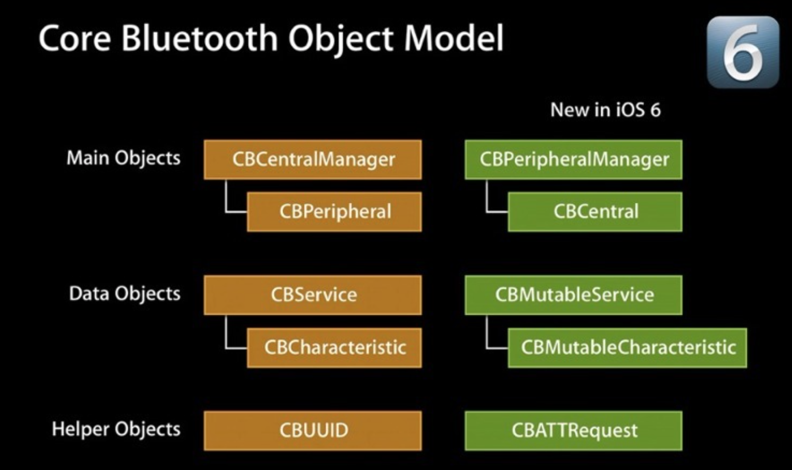

## 蓝牙相关总结

参考:

[http://liuyanwei.jumppo.com/2015/08/14/ios-BLE-2.html](http://liuyanwei.jumppo.com/2015/08/14/ios-BLE-2.html)

[http://www.jianshu.com/p/ee4fef3762ef](http://www.jianshu.com/p/ee4fef3762ef)

[https://juejin.im/entry/587b2c6b128fe10057f1bfc5](https://juejin.im/entry/587b2c6b128fe10057f1bfc5)

[http://liuyanwei.jumppo.com/2015/07/17/ios-BLE-1.html](http://liuyanwei.jumppo.com/2015/07/17/ios-BLE-1.html)

[http://liuyanwei.jumppo.com/2015/08/14/ios-BLE-2.html](http://liuyanwei.jumppo.com/2015/08/14/ios-BLE-2.html)

Apple中我们讨论蓝牙考虑4.0

蓝牙4.0和2.0相比更省电，超长连接距离，最远100米，建议30米内有效距离；在 4s 及之后或iPad2及以后都支持4.0，并且要求系统版本不低于5.1；蓝牙4.0开发需要coreBluetooth框架.

在CoreBluetooth框架中，有两个主要的角色：周边和中央（Peripheral and Central） ，整个框架都是围绕这两个主要角色设计的，他俩之间有一系列的回调交换数据. 

几点概念:

- Peripheral: 外围设备, 或者叫周边, 是生成或者保存了数据的设备

- Central: 中央, 是使用这些数据的设备, 所有可用的iOS设备可以作为外围设置（Peripheral）也可以作为中央（Central），但不可以同时既是外围设备也是中央.  

- CBPeripheralManager：周边管理器(外围设备管理器), 

- CBCentralManager ：中央管理器

- 说明: 在周边这边，一个CBCentral 对象代表着相应的和周边连接着的中央, 在中央这边，一个CBPeripheral 对象代表着相应的和中央连接着的周边, 周边是一个广播数据的设备，他广播到外部世界说他这儿有数据，并且也说明了能提供的服务。另一边，中央开始扫描附近有没有服务，如果中央发现了想要的服务，然后中央就会请求连接周边，一旦连接建立成功，两个设备之间就开始交换传输数据了。

  周边设备：作为服务端，向外界提供服务， 发送数据给中央设备;

  中央设备：作为客户端，扫描周边设备，然后连接，找到周边设备提供的合适的服务和特征，接收数据

  每个蓝牙4.0的设备都是通过服务(CBService)和特征(CBCharacteristic)来展示自己的，一个设备必然包含一个或多个服务，每个服务下面又包含若干个特征。特征是与外界交互的最小单位。比如说，一台蓝牙4.0设备，用特征A来描述自己的出厂信息，用特征B来表示收发的数据等.  

周边设备的操作流程:

- 启动一个Peripheral管理对象并设置服务, 特征, 描述, 权限等等:
  - 创建特征CBCharacteristic
  - 创建服务CBService并将特征加载服务上
  - 把服务添加到周边管理器
  - ...
- Peripheral开始广播服务
- 等待连接和订阅
- 发送数据给中央设备
- 断开连接

中央设备的操作流程

- 创建中央设备管理器CBPeripherManagerr
- 扫描周边设备, 即扫描外设(discover)
- 连接周边设备, 即连接外设(connect)
- 扫描外设中的服务和特征(discover)
  - 获取外设的services
  - 获取外设的Characteristics,获取Characteristics的值，获取Characteristics的Descriptor和Descriptor的值
- 与外设做数据交互(explore and interact)
- 订阅Characteristic的通知
- 断开连接(disconnect)

**蓝牙设备状态**

1. 待机状态（standby）：设备没有传输和发送数据，并且没有连接到任何设
2. 广播状态（Advertiser）：周期性广播状态
3. 扫描状态（Scanner）：主动寻找正在广播的设备
4. 发起链接状态（Initiator）：主动向扫描设备发起连接。
5. 主设备（Master）：作为主设备连接到其他设备。
6. 从设备（Slave）：作为从设备连接到其他设备。

**蓝牙设备的五种工作状态**

1. 准备（standby）
2. 广播（advertising）
3. 监听扫描（Scanning
4. 发起连接（Initiating）
5. 已连接（Connected）

liuyanwei的博文代码:

[http://liuyanwei.jumppo.com/2015/08/14/ios-BLE-2.html](http://liuyanwei.jumppo.com/2015/08/14/ios-BLE-2.html)

我们具体说明一下中心模式的应用场景。主设备（手机去扫描连接外设，发现外设服务和属性，操作服务和属性的应用。一般来说，外设（蓝牙设备，比如智能手环之类的东西）， 会由硬件工程师开发好，并定义好设备提供的服务，每个服务对于的特征，每个特征的属性（只读，只写，通知等等），本文例子的业务场景，就是用一手机app去读写蓝牙设备.

**ios连接外设的代码实现流程**

1. 建立中心角色
2. 扫描外设（discover）
3. 连接外设(connect)
4. 扫描外设中的服务和特征(discover)
    - 4.1 获取外设的services
    - 4.2 获取外设的Characteristics,获取Characteristics的值，获取Characteristics的Descriptor和Descriptor的值
5. 与外设做数据交互(explore and interact)
6. 订阅Characteristic的通知
7. 断开连接(disconnect)

**1 导入CoreBluetooth头文件，建立主设备管理类，设置主设备委托**

